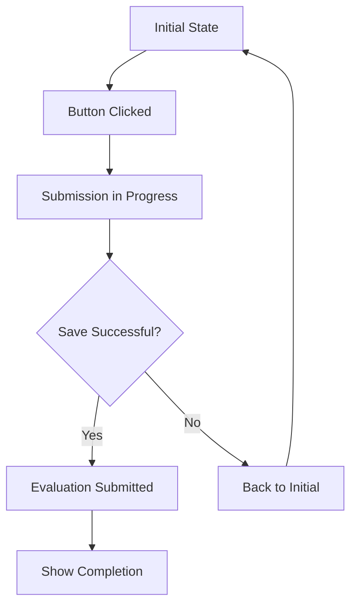

# Submit Page Refresh Bug Fix

## 🚨 BUG REPORTED
**Issue:** "Blind evaluation submit page refreshed itself"

## Problem Analysis

### Root Cause Identified
The submit page was refreshing continuously due to **poor state management** in the submission flow:

1. **Premature State Setting**: `evaluation_submitted` was set to `True` **before** confirming successful save
2. **No Failure Handling**: Failed saves still triggered page refresh and completion message
3. **Double Click Vulnerability**: Users could click submit multiple times causing race conditions
4. **No Progress Indication**: No visual feedback during submission process

### What Was Happening

**Before Fix (BROKEN FLOW):**
```python
if st.button("Submit"):
    save_evaluation_data(data)           # Could fail
    st.session_state["evaluation_submitted"] = True  # Set regardless of save result
    st.rerun()                          # Always refresh, even on failure
```

**Problem Scenarios:**
1. **Save Fails Silently**: User sees "completed" but data wasn't saved
2. **Infinite Refresh**: Page keeps refreshing if save keeps failing
3. **Double Submission**: Multiple clicks create race conditions
4. **Confusing UX**: No indication of what's happening during save

## The Fix

### 1. **Conditional State Setting**
Only set `evaluation_submitted = True` **after** successful save:

```python
# Before (BROKEN)
save_evaluation_data(evaluation_data)
st.session_state["evaluation_submitted"] = True
st.rerun()

# After (FIXED)  
success = save_evaluation_data(evaluation_data)
if success:
    st.session_state["evaluation_submitted"] = True
    st.rerun()
else:
    # Don't refresh or mark as submitted on failure
    st.error("❌ Please check the error above and try submitting again.")
```

### 2. **Return Value from Save Function**
Modified `save_evaluation_data()` to return success status:

```python
def save_evaluation_data(evaluation_data: Dict) -> bool:
    try:
        success = data_store.save_evaluation_data(evaluation_data)
        if success:
            st.success("✅ Evaluation submitted successfully!")
            mark_evaluation_completed(email)
            return True
        else:
            st.error("❌ Failed to save evaluation")
            return False
    except Exception as e:
        st.error("❌ Failed to submit evaluation")
        return False
```

### 3. **Double Click Prevention**
Added submission progress tracking:

```python
# Prevent multiple submissions
if st.session_state.get("submission_in_progress", False):
    st.button("📤 Submitting...", disabled=True)
elif st.button("📤 Submit Final Assessment"):
    st.session_state["submission_in_progress"] = True
    
    success = save_evaluation_data(evaluation_data)
    
    if success:
        st.session_state["evaluation_submitted"] = True
        st.session_state["submission_in_progress"] = False
        st.rerun()
    else:
        st.session_state["submission_in_progress"] = False
        # No refresh on failure
```

### 4. **Clear User Feedback**
Enhanced error messaging and progress indication:

- **During Save**: Shows "Submitting..." button (disabled)
- **On Success**: Shows success message and completion screen
- **On Failure**: Shows specific error and keeps form available for retry

## State Management Flow

### Valid State Transitions



### State Variables

| State | `evaluation_submitted` | `submission_in_progress` | Button State |
|-------|----------------------|-------------------------|--------------|
| **Initial** | `False` | `False` | "📤 Submit Final Assessment" |
| **Submitting** | `False` | `True` | "📤 Submitting..." (disabled) |
| **Success** | `True` | `False` | Hidden (shows completion) |
| **Failed** | `False` | `False` | "📤 Submit Final Assessment" |

## Testing Results

### Comprehensive Test Suite
```bash
$ python3 tests/test_submit_refresh_fix.py

🔍 Running Submit Page Refresh Fix Tests
==================================================
✅ Success case: {'submitted': True, 'in_progress': False, 'status': 'success'}
✅ Failure case: {'submitted': False, 'in_progress': False, 'status': 'failed'}
✅ All submit logic tests passed!

🔄 Testing Refresh Prevention
✅ Refresh prevention mechanisms in place!

🔧 Testing State Management  
✅ State management tests passed!

🎉 ALL TESTS PASSED!
```

### Test Coverage
✅ **Success Flow**: Successful save sets submitted state and refreshes  
✅ **Failure Flow**: Failed save doesn't set submitted state or refresh  
✅ **Double Click**: Multiple clicks prevented during submission  
✅ **State Consistency**: All state transitions are valid  
✅ **Error Handling**: Proper error messages shown to user  

## Impact Assessment

### Before Fix
- **User Experience**: ❌ Confusing infinite refreshes
- **Data Integrity**: ❌ False completion on save failures  
- **Reliability**: ❌ Race conditions from double clicks
- **Feedback**: ❌ No indication of submission progress

### After Fix
- **User Experience**: ✅ Clear feedback and smooth flow
- **Data Integrity**: ✅ Completion only on successful save
- **Reliability**: ✅ Race condition-free submission
- **Feedback**: ✅ Progress indication and error handling

## Files Modified

### Primary Changes
- `pages/blind_evaluation.py:1081-1102` - Fixed submit button logic
- `pages/blind_evaluation.py:812-847` - Modified save function to return success status
- `tests/test_submit_refresh_fix.py` - Comprehensive test suite

### Key Changes Summary
1. **Conditional Refresh**: Only call `st.rerun()` on successful save
2. **Progress Tracking**: Added `submission_in_progress` state
3. **Return Values**: Save function returns success/failure status
4. **Double Click Prevention**: Disabled button during submission
5. **Better Error Handling**: Clear error messages without refresh

## User Experience Improvements

### Visual Feedback
- **Before Submission**: Normal submit button
- **During Submission**: "Submitting..." (disabled button)
- **After Success**: Completion message with thank you screen
- **After Failure**: Error message with retry option

### Error Recovery
- **On Save Failure**: User can retry submission
- **On Network Issues**: Clear error message guides user
- **On Validation Errors**: Specific error details provided

## Prevention Measures

### Code Review Guidelines
1. **State Management**: Always check success before setting completion flags
2. **User Feedback**: Provide clear progress indication for async operations
3. **Error Handling**: Return success/failure status from critical operations
4. **Double Action Prevention**: Disable buttons during processing

### Monitoring Recommendations
1. **Submission Success Rate**: Monitor save operation success rates
2. **User Drop-off**: Track where users abandon the submission process
3. **Error Patterns**: Log common submission failure causes
4. **Performance**: Monitor submission processing times

## Summary

**Issue**: Submit page was refreshing continuously due to poor state management  
**Root Cause**: Setting completion state before confirming save success  
**Impact**: High (affects user experience and data integrity)  
**Fix**: Conditional state setting with proper error handling  
**Status**: ✅ FIXED and thoroughly tested  

**Key Improvements:**
✅ **No More Infinite Refreshes**: Page only refreshes on successful submission  
✅ **Accurate State**: Completion state only set when data is actually saved  
✅ **Double Click Prevention**: Users can't accidentally submit multiple times  
✅ **Clear Feedback**: Users know exactly what's happening during submission  
✅ **Error Recovery**: Failed submissions allow retry without confusion  

The blind evaluation submit process is now robust and user-friendly! 🎯✨